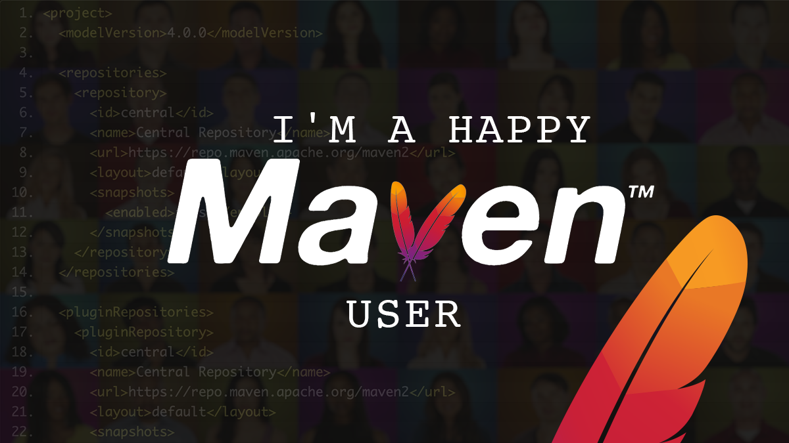

<!-- markdownlint-disable MD033 MD041 -->

  <h1 align="left">👋 Hey there, I'm Tomer Figenblat 👋 
    
    
    
    
    
  </h1>

  <h3 align="left">
  I'm a software developer and a development ecosystem enthusiast... 
  That means that if I'm not coding for work...

  **:metal: I'm coding for fun! :metal:**
  </h3>

  My weapon of choice :gun: is *Java*, I absolutely :heart: *Java*. 
  But I also do some *C#*, *Python*, *Groovy*, and a couple of other languages. 
  When they are more in line with what I'm working on at the time.

The profile repository has a couple of example phrases, to get you going... 
And... They're cool!

So I'm just gonna drop some of them here: :grin: 

- 🔭 *I’m currently working on ...* A microservice for work involving telephony :telephone_receiver:

- 🌱 *I’m currently learning ...* the power of `JPMS`. :muscle:

- 👯 *I’m looking to collaborate on ...* Java projects, if you see something, do tell! :handshake:

- 🤔 *I’m looking for help with ...* Finding a way to add more hours to every day. :hourglass_flowing_sand:

- 💬 *Ask me about ...* New frameworks and APIs, I love new frameworks and APIs. :eyeglasses:

- 📫 *How to reach me: ...* You can [Gmail me](mailto:tomer.figenblat@gmail.com). :speech_balloon:

- ⚡ *Fun fact: ...* Is it weird that I love refactoring code even if it's not my own :question:

#### My Latest Dev Community Posts

<!-- DEVDOTTO:START -->
- [JPMS Migration Playground](https://dev.to/tomerfi/jpms-migration-playground-a94)
- [My Ultimate Development Dockerfile](https://dev.to/tomerfi/my-ultimate-development-dockerfile-4hg1)
- [Dependency Injection in Java is easy - Part 3 - Leveraging with Spring Context](https://dev.to/tomerfi/dependency-injection-in-java-is-easy-part-3-leveraging-with-spring-context-gcc)
- [Dependency Injection in Java is easy - Part 2 - Leveraging with Google Guice](https://dev.to/tomerfi/dependency-injection-in-java-is-easy-part-2-leveraging-with-google-guice-6i4)
- [Dependency Injection in Java is easy - Part 1 - Merely a design pattern](https://dev.to/tomerfi/dependency-injection-in-java-is-easy-part-1-a-mear-design-pattern-2l8)
- [Experimenting with RobotFramework and Selenium](https://dev.to/tomerfi/experimenting-with-robotframework-and-selenium-4jgc)
- [Groovying with Java](https://dev.to/tomerfi/groovying-with-java-59hp)
<!-- DEVDOTTO:END -->

#### My Latest YouTube Videos

<!-- YOUTUBEVIDS:START -->
- [Docker for beginners part 2 video 2/2 in Hebrew (better quality)!](https://www.youtube.com/watch?v=GXq2ed64_Cs)
- [Docker for beginners part 2 video 1/2 in Hebrew (better quality)!](https://www.youtube.com/watch?v=gv71FJzHtKU)
<!-- YOUTUBEVIDS:END -->

#### On a day-to-day basis I work with

  
  
  
  
  
  
  
  
  
  
  
  

#### I would also want to point out that 😎

  

